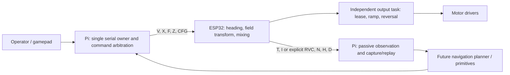

# Mechbot navigation interface plan

September 8, 2026. Source review for Notion task 06. This plan records selected
implementation boundaries; it is not evidence that navigation is deployed or
that Nathan has accepted the physical behavior.

## Responsibilities

The deployed Pi entry point is `/home/nate/pi_mecanum_gamepad.py`, a copy of
`mechbot_bridge.py`. It remains the only serial owner. HTTP clients, gamepad,
tuner and future navigation submit requests through this owner. The repository's
standalone sender must not be installed over that entry point.

The ESP32 retains motor pins, encoder sampling, actuator limits, frame
transformation, heading correction, reversal pause and independent 300 ms lease.
The Pi owns operator input, explicit mode selection, recording, evidence and
future high-level planning. A Pi failure cannot extend the ESP32 motor lease.
Do not place a second motor writer beside the existing output task.

## Current wire contract

Transport is 115200-baud USB serial between Pi and Maker; Wi-Fi connects clients
to the Pi. Components use forward-positive, left-positive, CCW-positive normalized
commands, and wheel order FL/FR/RL/RR. Physical IMU sign and mounting remain an
acceptance measurement.

| Interface | Existing meaning | Integration rule |
| --- | --- | --- |
| `V forward left ccw` | Finite normalized components; refreshed at 20 Hz | These are open-loop commands, not m/s or rad/s. Preserve bounded input and malformed-command stops. |
| `X` | Immediate zero PWM/coast | Highest priority; does not establish mechanical stopping distance. |
| `F 0`, `F 1`, `Z` | Robot frame, capture field frame, replace field zero | All stop first. No automatic frame change on sensor recovery. Maker's September 8 source latches lost-field stops until explicit F 0/fresh F 1. |
| `CFG GET/SET/SAVE/RESET` | Live settings; explicit persistent save | Preserve existing settings and defaults. Do not automatically save trial parameters. |
| `T` | Device time and four signed encoder counts | Use per-wheel measured CPR; invalidate rate/pose after reset/gap. |
| `I` | Quaternion, gyro, linear acceleration and accuracy status, or unavailable | Do not fill absent RVC gyro/calibration fields with zeros or synthesized confidence. |
| `N`, `H` | Navigation state and IMU health | Distinguish control eligibility from physical sensor availability and from measured accuracy. |
| `D`, `P` | Encoder/PWM diagnostics and peripheral readback | PWM readback is not wheel speed, supply voltage or measured waveform. |
| RVC `RUN/VALUE/COUNTS/UART_EVENTS` | Standalone orientation, raw mg and communication counters | Passive `observed.rvc`; not a robot firmware identity or navigation permission. |

The integrated RVC option is now implemented and deployed with distinct `IR1` telemetry,
session acceptance and matched identity/build selection; see [INTEGRATED_RVC.md](INTEGRATED_RVC.md).
Stopped deployment verification passed; physical accuracy and driving acceptance remain open. The following compatibility rules apply.

Existing parsers and exact board identities must be updated together when a
new integrated RVC firmware identity is introduced. Old clients should see
unavailable capabilities rather than valid-looking replacement gyro or linear
acceleration. Add a distinct versioned RVC sensor record before integrating the
receiver; keep the legacy `I` contract intact for SPI/S3.

## Heading and frame state

For a future integrated receiver, define a heading sample containing transport,
finite `yaw_rad`, receive time, stream validity, reference generation and
optional calibration status. RVC calibration status stays unknown. A separate
session-level operator acceptance of mounting/sign/accuracy must gate field
control; do not translate UART qualification into BNO calibration status 1–3.

At startup, heading and field correction stay off. Field zero is the orientation
captured by explicit F 1/Z, not magnetic north. Translation starts a hold target;
deliberate turns update it; idle does not rotate to recover an old target.
The existing robot-relative hold bypasses unavailable heading, while field
translation stops. A lost field reference latches all motion until a fresh
explicit mode selection; recovery must not reinterpret old V commands.

A sensor reset, estimator reset or field re-zero changes the reference generation
and invalidates an engaged navigation primitive. Releasing a deadman or receiving
fresh data must not resume an interrupted primitive.

## Pose, speed and future navigation

Current passive odometry is the source of observations in this tree. It requires
measured loaded wheel diameter, full wheel-centre wheelbase and track width plus
the four measured CPR values. Missing geometry remains unavailable. Do not invent
dimensions to advance task 06 or label encoder motion as physical travel.

Reuse the separate Mecha repository selectively:

- `Maker_Mechbot/CommandArbiter.h`: stop > manual deadman > autonomous > idle;
  invalid manual input stops rather than falling through; preempted generations
  remain blocked. Port this tested contract into the single Pi owner when adding
  autonomy, with parity tests against the existing C++ model.
- `NavigationState.h`: explicit arm/start/pause/cancel/fault lifecycle. Preserve
  the terminal-state reset/arm/start requirements and feedback freshness gates.
- `PlanarPoseEstimator.h`, `MecanumOdometry.h`: use as reviewed reference/test
  oracles; do not run competing live estimators without an explicit source choice.
- Translation/rotation primitives and `simulation/WaypointFollower.h`: reuse
  offline first. Their output is normalized body commands; supply measured
  limits, actual pose/heading and cancellation semantics before connecting them.
- `docs/SERIAL_PROTOCOL.md` and `heading_hold_replay.py`: reuse only after matching
  record versions. Mecha's `W1`/`P1` and geometry CFG fields are not implemented by
  this Maker sketch simply because they exist in the other repository.

Wheel-speed feedback and proportional gamepad input remain gated by repeatable
directional motor response, clean encoder signals and low-power acceptance.
Keep the current cardinal sender until that gate is satisfied. Navigation has no
validated obstacle avoidance; simulation success does not imply safe floor travel.

## Linked implementation actions

| Action | Notion task | Evidence to close |
| --- | --- | --- |
| Confirm live board, firmware, buffer/power/mounting | 01 | Confirmed as-built record and baseline behavior |
| RVC startup and angle assessment; explicit missing-capability contract | 02, 07 | Saved known-reference observations and repeatable procedure; tested telemetry deployment |
| Integrate receive-only GPIO21 RVC with bounded polling, correct heading eligibility and no reset/mode pin writes | 02, 03 | Host fault/clock tests, exact target compile, supervised sensor/motor test |
| Retain heading prototype and field-loss latch; verify physical sign | 03 | Reviewed firmware plus recorded straight-drive results |
| Measure response before tuning gain/deadband/correction and proportional input | 04 | Repeatable low-speed trials with firmware, parameters, drift and oscillation logs |
| Connect explicit field/reference operator controls | 05 | Reference startup/re-zero/wrap tests and measured multi-heading interaction with hold |
| Port arbitration/lifecycle before connecting primitives | 06 | Interface agreement, offline parity tests and explicit implementation review |
| Validate intended surface, load and stopping behavior | 08 | Representative supervised trials and unresolved-issue record |

## Source review

Reviewed `Maker_Mechbot/Maker_Mechbot.ino`, `MotorSafety.h`, `NavigationMath.h`,
`mechbot_bridge.py`, `mechbot_profiles.py`, `mechbot_observer.py`,
`mechbot_operations.py`, `NAVIGATION_CONTROLS.md`, `GAMEPAD_INTEGRATION.md`, and
Mecha's command arbiter, navigation lifecycle, pose estimator and protocol docs.
Mecha's TASK-001–030 ledger explicitly limits its completion to offline scope.
This plan resolves ownership and compatibility choices without importing its
firmware or claiming its physical acceptance.
